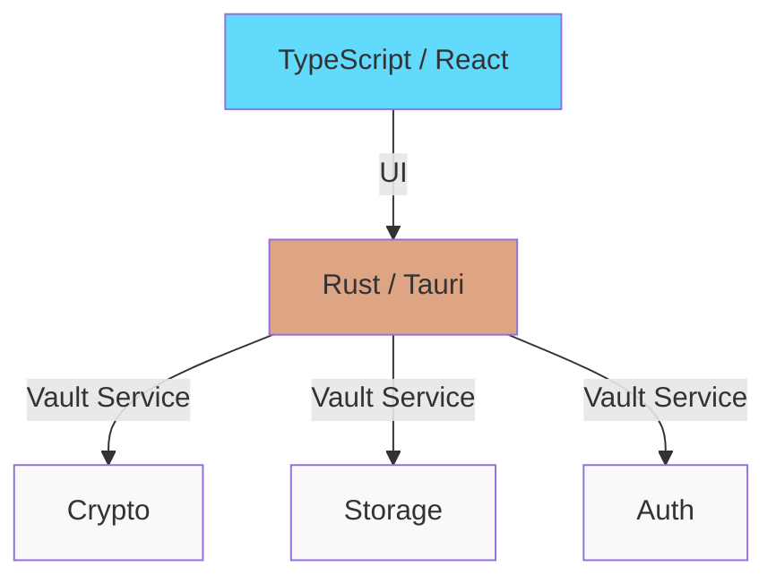

# CLAUDE.md

This file provides guidance to Claude Code (claude.ai/code) when working with code in this repository.

## Architecture Overview

Latch is a secure cross-platform password manager built with Tauri and Rust featuring a command-palette UI and multiple authentication methods:



- **Frontend**: React + TypeScript with a Raycast-style command palette interface
- **Backend**: Pure Rust vault module for crypto, storage, and session management
- **Communication**: In-memory via Tauri State, no IPC/process spawning
- **Authentication**: Google OAuth, Biometric (Windows Hello/Touch ID), or traditional password

### Key Architecture Constraints

1. **Layer Separation**: Frontend handles UI only. All crypto operations happen in Rust via the `Vault` struct.
2. **State Management**: Vault instance stored in `VaultState(Mutex<Vault>)` and shared across all Tauri commands.
3. **Multiple Auth Methods**: OAuth (Google), biometric (OS keychain), or password - all derive 256-bit encryption keys
4. **Session-Only Keys**: Decrypted vault key lives in memory only, cleared on lock or after 30min timeout.
5. **Command Palette UI**: Single window with mode-based navigation (auth-selector, oauth-login, biometric-login, search, actions, add-entry, edit-entry, settings)

### Component Interaction Flow

1. Frontend → Tauri command invocation via `invoke('command_name', { params })`
2. Tauri command handler → Acquires lock on `VaultState`
3. Vault method → Performs crypto/storage operation
4. Result → Serialized to JSON, returned to frontend

## Development Commands

### Initial Setup
```bash
./scripts/dev.sh           # Install dependencies (bun, check cargo)
```

### Running Development Server
```bash
cd frontend
bun run tauri dev         # Starts Vite + Tauri app with Rust backend
```

**Note**: Do NOT use `bun run dev` - that only starts Vite without Tauri APIs.

### Building
```bash
./scripts/build.sh         # Linux/macOS build
.\scripts\build.ps1        # Windows production build
```

Artifacts output to `dist/`.

### Type Checking & Linting
```bash
cd frontend
bun run typecheck         # TypeScript type check only
bun run lint              # ESLint check
bun run lint:fix          # Auto-fix ESLint issues
```

### Testing (Rust)
```bash
cd frontend/src-tauri
cargo test                # Run all tests
cargo test -- --nocapture # Run tests with stdout
```

## Code Structure

### Frontend (TypeScript/React)

**Main Component:**
- **`App.tsx`**: Entry point, handles vault state and determines initial mode based on vault status

**Command Palette System:**
- **`components/CommandPalette.tsx`**: Central UI component with Raycast-style command palette
- **`components/PaletteInput.tsx`**: Reusable text input for command palette
- **`components/PaletteList.tsx`**: Reusable list component for results
- **`components/PaletteActions.tsx`**: Action buttons for command palette

**Authentication Components:**
- **`components/AuthSelector.tsx`**: Choose auth method during setup (OAuth vs Biometric)
- **`components/OAuthSignIn.tsx`**: Google OAuth login flow
- **`components/BiometricSignIn.tsx`**: Biometric authentication prompt
- **`components/MigrateVault.tsx`**: Vault migration/re-encryption UI

**Other Components:**
- **`components/Settings.tsx`**: Auth method switching, preferences, session timer
- **`components/ConfirmationModal.tsx`**: Generic confirmation dialog
- **`components/LockButton.tsx`**: Manual vault lock button (legacy, may be unused)
- **`components/SetupVault.tsx`**: Initial vault creation (legacy password-based)
- **`components/UnlockVault.tsx`**: Vault unlock (legacy password-based)

**UI Behavior:**
- Window auto-resizes based on content (base: 640x88)
- Always on top, frameless window
- Hides on close (doesn't quit)
- Global shortcut: Ctrl+Space (or Alt+Space on some systems) to show/hide
- System tray with "Show Latch" and "Quit" options

### Backend (Rust - `frontend/src-tauri/src/`)

**Modules:**
- **`lib.rs`**: Tauri command handlers, system tray setup, global shortcut handler
- **`vault.rs`**: Core vault implementation
  - `Vault` struct: Manages entries, session key, vault file, auth method
  - `Entry` struct: Password entry with id, title, username, password, url, notes
  - `EntryPreview` struct: Search results (id, title, username only)
- **`oauth.rs`**: Google OAuth integration
  - `derive_key_from_oauth()`: Derives 256-bit key from Google user_id using Argon2id
  - `decode_id_token()`: Extracts user_id from verified Google ID token

**Tauri Commands:**

Vault Management:
```rust
vault_status              // Check if vault exists and is unlocked
init_vault_oauth          // Create new vault with Google OAuth
init_vault_with_key       // Create new vault with biometric or password
unlock_vault_oauth        // Unlock vault with Google OAuth
unlock_vault_with_key     // Unlock vault with biometric or password
lock_vault                // Lock vault and clear session
get_vault_auth_method     // Get auth method ('oauth', 'biometric-keychain', 'password')
reencrypt_vault           // Re-encrypt vault with new auth method
reencrypt_vault_to_oauth  // Re-encrypt vault to use Google OAuth
```

Entry Operations:
```rust
search_entries            // Fuzzy search entries by title/username
request_secret            // Get password or other field for specific entry
add_entry                 // Add new password entry
get_full_entry            // Get complete entry details
update_entry              // Update existing entry
delete_entry              // Delete entry
```

Preferences:
```rust
get_auth_preferences      // Get auth preferences (for settings UI)
```

### Tauri Command Pattern
All commands follow this pattern:
```rust
#[tauri::command]
async fn command_name(param: String, state: State<'_, VaultState>) -> Result<String, String> {
    let vault = &mut state.0.lock().unwrap();
    let result = vault.method_name(&param)?;
    Ok(json!({"status": "success", ...}).to_string())
}
```

Response format must include `status` field (typically `"success"`) for frontend compatibility.

## Authentication Methods

### 1. Google OAuth
- **Flow**: User signs in with Google → ID token verified by plugin → user_id extracted → key derived via Argon2id
- **Key Derivation**: Argon2id (m=32768, t=2, p=2) with app secret + user_id
- **Plugin**: `tauri-plugin-google-auth` handles OAuth flow and token verification
- **Environment**: `LATCH_OAUTH_SECRET` env var for production (fallback dev secret in code)

### 2. Biometric Authentication
- **Flow**: 256-bit random key generated → stored in OS keychain → biometric prompt to unlock
- **Platforms**: Windows Hello, Touch ID (macOS), biometric providers (Linux)
- **Plugin**: `tauri-plugin-biometry` handles keychain storage and biometric prompts
- **Storage**: Windows Credential Manager, macOS Keychain, etc.

### 3. Traditional Password (Legacy)
- **Flow**: Master password → Argon2id KDF → 256-bit encryption key
- **Key Derivation**: Argon2id (m=65536, t=3, p=4) with random salt
- **Status**: Still supported for backwards compatibility

### Auth Method Switching
Users can switch between auth methods via Settings:
- Vault is decrypted with current method
- Re-encrypted with new method
- Auth method metadata updated in vault file

## Code Style Conventions

### TypeScript/React
- camelCase for variables and functions
- PascalCase for components and types
- Functional components with hooks
- `const [data, setData] = useState<Type[]>([])` for state
- Interfaces for all data structures
- Use `invoke()` from `@tauri-apps/api/core` for all backend calls

### Rust
- `#[tauri::command]` for exported commands
- `async fn name(param: String, state: State<'_, VaultState>) -> Result<String, String>`
- `?` operator for error propagation
- `json!()` macro for JSON responses
- Return `Err(String)` for all error cases

## Security Implementation

### Key Derivation & Encryption
- **OAuth KDF**: Argon2id (m=32768, t=2, p=2) with app_secret + user_id salt
- **Password KDF**: Argon2id (m=65536, t=3, p=4) with random 16-byte salt
- **Biometric**: Cryptographically secure random 256-bit key (no KDF needed)
- **Encryption**: AES-256-GCM with 12-byte nonce for all methods

### Vault Storage (OS-specific)
- Windows: `%APPDATA%\Latch\vault.enc`
- macOS: `~/Library/Application Support/Latch/vault.enc`
- Linux: `~/.config/latch/vault.enc`

Vault file format:
```json
{
  "version": "1",
  "auth_method": "oauth" | "biometric-keychain" | "password",
  "kdf": "argon2id",
  "salt": "<hex-encoded salt, empty for biometric>",
  "data": {
    "nonce": "<hex-encoded nonce>",
    "ciphertext": "<hex-encoded encrypted vault data>"
  }
}
```

### Session Management
- Session timeout: 30 minutes of inactivity
- Session key stored as `Option<[u8; 32]>` in memory
- `check_session()` validates timeout before operations
- `refresh_session()` updates `session_start` timestamp

### Key Storage
- **OAuth**: Key derived on-demand from user_id (not stored)
- **Biometric**: Random key stored in OS keychain
- **Password**: Key derived on-demand from password (not stored)

## Important Notes

- **No Password/Key Recovery**: Lost credentials = lost data (by design)
- **Cross-Platform**: Same vault file works across Windows/macOS/Linux
- **Zero-Knowledge**: For OAuth, only user_id is exposed - Google never sees vault data
- **Dev vs Prod**: OAuth uses fallback secret in dev, requires `LATCH_OAUTH_SECRET` in production
- **System Integration**: App stays running in background (system tray), use global shortcut or tray icon to show
