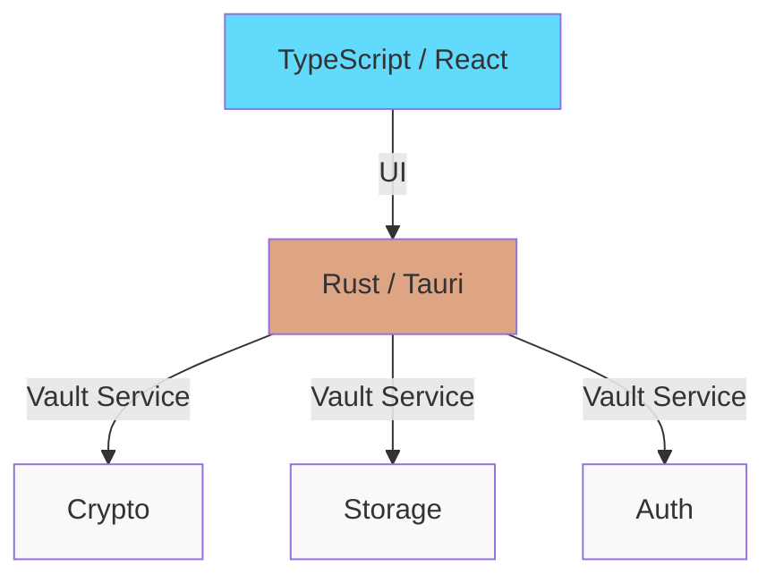

# Latch Password Manager

A secure cross-platform password manager built with Tauri and Rust.

## Architecture



## Features

- **Master Password Authentication**: Secure Argon2id key derivation with AES-256-GCM encryption
- **Cross-Platform**: Works on Windows, macOS, and Linux
- **Session Management**: Automatic 30-minute vault lock after inactivity
- **Local Storage**: Vault stored encrypted in OS-specific directories
- **Zero-Knowledge**: Master password never stored, only used for key derivation

## Prerequisites

- **Bun** for frontend dependencies
- **Rust + Cargo** (for Tauri)

## Development Setup

```bash
./scripts/dev.sh
```

## Building

### Windows

```powershell
.\scripts\build.ps1
```

### Linux/macOS

```bash
./scripts/build.sh
```

Artifacts are output to `dist/`.

## Running

```bash
cd frontend
bun run tauri dev
```

## Project Structure

```
latch/
├── frontend/          # Tauri + React + TypeScript UI
│   ├── src/
│   │   ├── components/
│   │   └── App.tsx
│   └── src-tauri/
│       ├── src/
│       │   ├── lib.rs      # Tauri commands
│       │   └── vault.rs    # Vault implementation
│       └── Cargo.toml
├── scripts/
│   ├── build.sh       # Linux/macOS build
│   ├── build.ps1      # Windows build
│   └── dev.sh         # Development setup
└── build.toml         # Build configuration
```

## Security

### Encryption
- **Key Derivation**: Argon2id with m=65536, t=3, p=4
- **Encryption**: AES-256-GCM with 12-byte nonce
- **Vault Storage**: OS-specific directories encrypted with master password

### Session Management
- Vault automatically locks after 30 minutes of inactivity
- Session key stored in memory only (never on disk)

### Important Notes
- **No Password Recovery**: Forgotten master password = lost data

## Screenshots / Demo

*(Coming soon! Insert your screenshots or GIF demo here.)*

## Roadmap

- [ ] Browser extension integration
- [ ] Mobile app (iOS/Android)
- [ ] Password sharing capabilities

## Troubleshooting

- **Vault not opening?** Check if you've entered the correct master password.
- **Frontend not building?** Ensure you have `bun` and the correct Node version installed.
- **Tauri build failing?** Check missing system dependencies for Tauri (e.g. `libwebkit2gtk-4.0-dev` on Linux).

## Contributing

Contributions are welcome! Please check out [CONTRIBUTING.md](CONTRIBUTING.md) for details on how to get started.

## Acknowledgments

- Built with [Tauri](https://tauri.app) and [React](https://reactjs.org)
- cryptographic functions powered by `argon2` and `aes-gcm`

## License

This project is licensed under the MIT License - see the [LICENSE](LICENSE) file for details.
