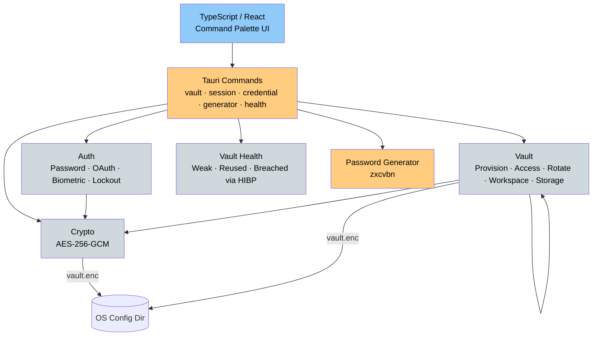

# Latch Password Manager

A secure cross-platform password manager with a Raycast-style command palette UI, built with Tauri v2 and Rust.

## Architecture


```mermaid
graph TD
    FE[TypeScript / React<br/>Command Palette UI]
    CM[Tauri Commands<br/>vault · session · credential · generator · health]
    AU[Auth<br/>Password · OAuth · Biometric · Lockout]
    VA[Vault<br/>Provision · Access · Rotate · Workspace · Storage]
    CR[Crypto<br/>AES-256-GCM]
    VH[Vault Health<br/>Weak · Reused · Breached via HIBP]
    PG[Password Generator<br/>zxcvbn]
    OS[(OS Config Dir)]

    FE --> CM
    CM --> AU & VA & CR & VH & PG
    AU --> CR
    VA --> CR & VA -->|vault.enc| OS

    style FE fill:#90caf9,color:#000000
    style CM fill:#ffcc80,color:#000000
    style AU fill:#cfd8dc,color:#000000
    style VA fill:#cfd8dc,color:#000000
    style CR fill:#cfd8dc,color:#000000
    style VH fill:#cfd8dc,color:#000000
    style PG fill:#ffcc80,color:#000000
```

## Features

- **Three Auth Methods**: Master Password (PBKDF2), Google OAuth (Argon2id), or Biometric (OS keychain)
- **Command Palette UI**: Raycast-style single-window interface with keyboard navigation
- **Password Generator**: Configurable passwords with zxcvbn strength analysis
- **Vault Health Dashboard**: Detects weak, reused, and breached credentials via HIBP k-anonymity API
- **Session Management**: 30-minute auto-lock with clipboard auto-clear
- **Vault Migration**: Re-encrypt between auth methods without losing credentials
- **Lockout Protection**: Exponential backoff on failed auth attempts (5s → 5min max)
- **Zero-Knowledge**: Master password never stored, session key in memory only
- **Cross-Platform**: Windows, macOS, Linux — identical vault file format
- **Automatic Updates**: GitHub Releases-based updater with Tauri updater plugin

## Prerequisites

- **Bun** (for frontend dependencies)
- **Rust + Cargo** (stable, with `rustfmt` and `clippy`)
- **Tauri v2 system dependencies** (see [Tauri docs](https://v2.tauri.app/start/prerequisites/))

## Development

```bash
cd frontend
bun install
bun run tauri dev
```

## Building

Builds and releases are handled by GitHub Actions CI. See `.github/workflows/release.yml`.

## Project Structure

```
frontend/          # Tauri v2 + React + TypeScript (api/, components/, hooks/, utils/)
frontend/src-tauri/ # Rust backend (auth/, commands/, crypto/, vault/, vault_health/)
docs/adr/          # Architecture Decision Records
build.toml         # Build configuration
```

## Security

### Encryption & Key Derivation
- **Password Auth**: PBKDF2-HMAC-SHA256, 100,000 iterations
- **OAuth Auth**: Argon2id with m=65536, t=3, p=4
- **Encryption**: AES-256-GCM with random 12-byte nonce
- **KDF-per-AuthMethod**: Each auth method uses a tailored KDF (see ADR-0002)

### Session Management
- Vault auto-locks after 30 minutes of inactivity
- Session key (`Zeroizing`) stored in memory only — cleared on lock
- Clipboard auto-clears 30 seconds after copy

### Important Notes
- **No Password Recovery**: Forgotten master password = lost data (by design)
- **Cross-Platform**: Vault file format identical across all platforms

## Troubleshooting

- **Vault not opening?** Check you're using the correct auth method and credentials.
- **Frontend not building?** Ensure you have `bun` and the correct Node version installed.
- **Tauri build failing?** Check missing system dependencies (e.g. `libwebkit2gtk-4.0-dev` on Linux).

## Contributing

Contributions are welcome! See [CONTRIBUTING.md](CONTRIBUTING.md) and [AGENTS.md](AGENTS.md) for development guidelines.

Before opening a PR, run the CI checks locally:
```bash
# Backend
cd frontend/src-tauri && cargo fmt --all && cargo check && cargo clippy --all-targets --all-features -- -D warnings && cargo test

# Frontend
cd frontend && bun run typecheck
```

## Acknowledgments

- Built with [Tauri](https://tauri.app), [React](https://reactjs.org), and [shadcn/ui](https://ui.shadcn.com)
- Cryptographic functions powered by `aes-gcm`, `argon2`, and `pbkdf2`
- Password strength via `zxcvbn`
- Breach checking via [Have I Been Pwned](https://haveibeenpwned.com) k-anonymity API

## License

MIT — see [LICENSE](LICENSE).
